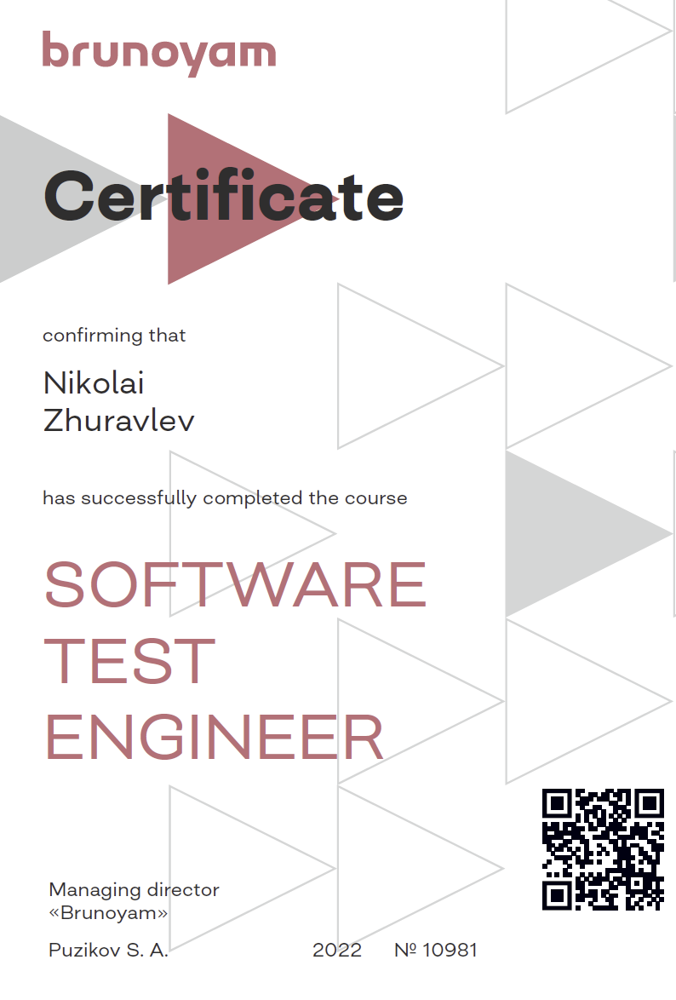
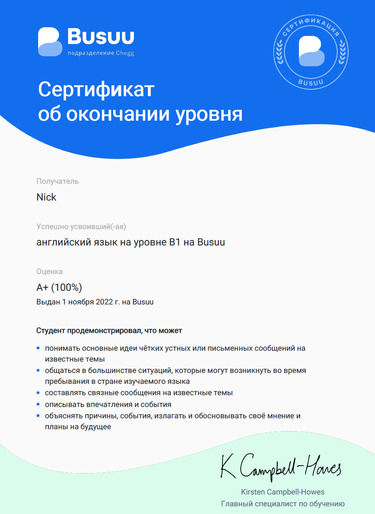

<!---->

 
 

<h1 align="center"> Hi there 👋 </h1>

<h2 align="center"> I'm Nikolai and you can learn more information about me and tools I use beneath </h2>
 
 
 
<h3 align="left"> Сheck out my <a href="https://drive.google.com/file/d/13ccjGmmKePU6CzG8RiyijSYLzqPSi40-/view?usp=share_link" title="ru-version" target="_blank"> resume </a> </h3>

--- 

<h3 align="left"> Tools </h3>

 
                     

---

<h3 align="left"> Click on badges below to see my skills in some tools </h3>

 
 

---

<h3 align="left"> Certificates </h3>

 
  
 

---

<h3 align="left"> Ways to contact me </h3>

   

---

<h3 align="left"> Latest tweets </h3>

 

