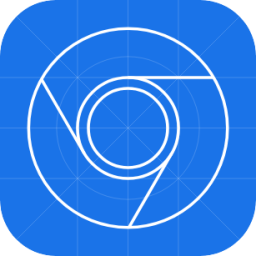

# **`Hi there!`**
 
## My name is Nikolai and you can learn more information about me and tools I use below

## Сheck out my [resume](https://drive.google.com/file/d/13ccjGmmKePU6CzG8RiyijSYLzqPSi40-/view?usp=sharing "ru-version")

## Tools

 

 

 

 

 
 

 
 
 
 

## Next сhapter
